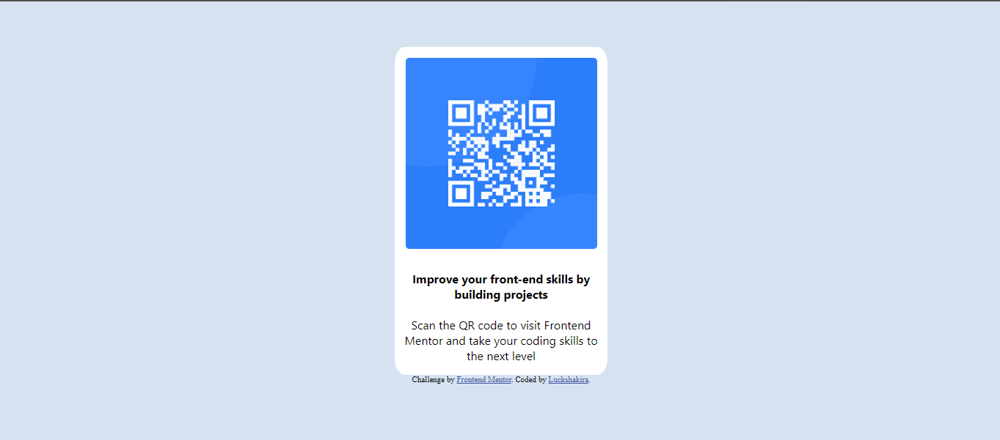

# HTML-CSS Projects

### Overview
This repository contains a compilation of HTML and CSS projects I completed during Week 1 of the **Teach2Give** program. The projects in this repository cover basic to intermediate concepts of web development, focusing on HTML structure, CSS styling, layouts, and responsive design.

### Screenshots
Task 1

Task 2

Task 3

Task 4

Task 5


### Technologies Used
- **HTML:** For structuring the content on web pages.
- **CSS:** For styling, including layouts, colors, fonts, and grid-based designs.

### How to Run the Project
To view and explore the projects:
1. Clone the repository to your local machine:
   ```bash
   git clone https://github.com/devshakie/HTML-CSS.git
2.Navigate to the folder of the assignment you want to view:
cd HTML-CSS/assignment1  # or any other assignment folder

### Contact   
For any questions or suggestions, feel free to contact me via [LinkedIn](https://www.linkedin.com/in/luckshakira-kanana-0733b923b)


